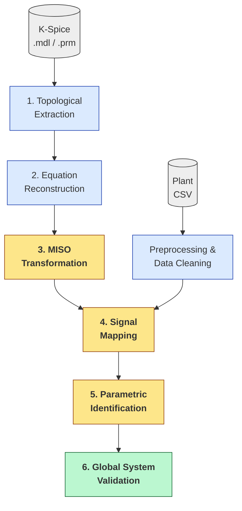

# K-Spice → TSA System Conversion

Grey-box identification pipeline that converts a high-fidelity K-Spice plant
simulation into a modular network of MISO surrogate models. Topology is
extracted from K-Spice's `.mdl` / `.prm` model files and fused with a 1 Hz
simulation CSV exported from K-Spice. The CSV must contain setpoint changes
and manual moves that excite the plant so its dynamics can be observed; a
flat steady-state CSV yields no information about time constants.

The numerical engine is [Equinor's TimeSeriesAnalysis](https://github.com/equinor/TimeSeriesAnalysis)
library, which provides robust first-order dynamic identification, PID
identification, and OLS regression. TSA is used directly for the components
where standard linear identification is sufficient:

- **Separator and tank pressure** dynamics
- **Liquid level** integration
- **PID controllers** (Kp, Ti recovery, with a gain-scale search fallback
  for low-excitation data)
- **Generic linear process states** that have no specialised physics

On top of TSA the pipeline layers custom physics-guided models for the
components where pure linear identification fails to capture the underlying
behaviour. These still fit their parameters via OLS regression, but enforce
a constrained structure that the linear identifiers cannot:

- **Valves**: square-root pressure-drop law $\dot{m} = k \cdot C_v(u) \cdot \sqrt{P_{in} - P_{out}}$
  with a fitted density-tuning factor.
- **Heat exchangers**: split gas-side / water-side identification with an
  NTU-effectiveness fallback when OLS produces unphysical signs (e.g.
  cooling water that appears to heat the gas).
- **Inter-stage junctions**: pipe headers where two compressor trains meet
  but no physical separator vessel exists. A pipe junction without buffering
  is mathematically unstable in closed-loop. The pipeline detects this case
  from topology and treats the junction as a virtual mass-balance vessel,
  applying the same $dP/dt = k \cdot (\dot{m}_{in} - \dot{m}_{out})$
  equation a real separator would use so the closed-loop simulation has a
  stable pressure node.
- **Anti-surge controllers**: dual-mode PI with parameters read from the
  K-Spice model file and refined via a 4D grid search.

Each block is re-assembled into a custom topology-aware closed-loop simulator
that runs without K-Spice.

## Methodology



Physical K-Spice metadata (left branch) is fused with empirical transients
(right branch) to generate the surrogate network. Phases 3–5 are the core MISO
fitting stage; Phase 6 re-runs the identified blocks plant-wide in closed loop.

## Requirements

- Python 3.10+ (`pandas`, `numpy`, `matplotlib`)
- .NET 10 SDK (for the C# identification engine)

## Project layout

```
SystemConvertion/
├── kspicefiles/           ← place your K-Spice .mdl / .prm here
├── Pipeline/
│   ├── data/
│   │   ├── raw/           ← place your training simulation CSV here (any filename)
│   │   ├── test/          ← place your held-out test CSV here (any filename)
│   │   └── extracted/     ← KSpiceSystemMap.json (generated)
│   ├── output/            ← all generated artefacts
│   │   ├── diagrams/      ← TSA_Equations.json, topology HTML
│   │   ├── validation_plots*/
│   │   ├── CS_Predictions*.csv
│   │   └── CS_Identified_Parameters.json
│   ├── src/
│   │   ├── Parser/        ← K-Spice XML parser (Phase 1)
│   │   ├── Visualization/ ← topology builders (Phase 3 + diagrams)
│   │   └── CSharp_Engine/ ← identification engine (Phases 2 & 4, tests)
│   └── run.py             ← single entry point
└── TimeSeriesAnalysis-master/
```

## Inputs

1. **K-Spice model files** — copy your `.mdl` and `.prm` files into
   [`kspicefiles/`](kspicefiles/). One folder can hold multiple revisions; the
   pipeline lists them and asks which one to use.
2. **Training CSV** — export a 1 Hz time-series from K-Spice that **excites**
   the plant: setpoint steps, manual valve moves, load changes — anything that
   forces the states to respond. Without excitation there is no information in
   the data for the identifier to fit time constants and gains to. Drop the
   file into [`Pipeline/data/raw/`](Pipeline/data/raw/); any filename works,
   the runner auto-picks the single CSV in that folder (or prompts if there
   are several).
3. **(Optional) Held-out test CSV** — drop it into
   [`Pipeline/data/test/`](Pipeline/data/test/). Same plant, different operating
   trajectory, never seen during training. Used by the open-loop (`testset`) and
   closed-loop test phases. Override with `--testcsv path/to/file.csv`.

## Usage

All commands run from the `Pipeline/` directory.

### Full pipeline (interactive model picker)

```bash
cd Pipeline
python run.py
```

The runner lists the `.mdl` files it finds, asks you to pick one, then runs
Phases 1–5 (extract → equations → topology → simulate → visualise). Outputs
land in `Pipeline/output/`.

### Single phases

```bash
python run.py --phase extract           # 1. Parse .mdl/.prm → KSpiceSystemMap.json
python run.py --phase equations         # 2. C# engine builds plant equations
python run.py --phase topology          # 3. Python wires the MISO graph
python run.py --phase simulate          # 4. C# identifies all models
python run.py --phase visualize         # 5. HTML topologies + validation plots
```

### Evaluation tests

```bash
python run.py --phase testset            # Open-loop on held-out CSV
python run.py --phase closedloop         # Closed-loop on held-out CSV
python run.py --phase closedloop-train   # Closed-loop on the training CSV
python run.py --phase tests              # All three above, in sequence
```

### Useful flags

```bash
python run.py --list                          # List available K-Spice models
python run.py --model Rev3B                   # Skip the picker (partial name match)
python run.py --csv path/to/sim.csv           # Override training CSV
python run.py --testcsv path/to/test.csv      # Override held-out CSV
```

## Outputs

After a full run you'll find:

| File | Purpose |
|------|---------|
| `output/diagrams/TSA_Equations.json` | One descriptor per modeled state |
| `output/diagrams/SignalMapping.json` | CSV column ↔ model-ID map |
| `output/diagrams/TSA_Explicit_Topology.json` | Wired MISO dependency graph |
| `output/CS_Identified_Parameters.json` | Fitted parameters for every model |
| `output/CS_Predictions*.csv` | Open- / closed-loop simulated states |
| `output/validation_plots*/` | Per-model PNGs (truth vs. prediction) |
| `output/diagrams/System_TSA_State_Topology.html` | Interactive MISO graph |
| `output/diagrams/System_Topology_V2.html` | Raw K-Spice connectivity |

## Notes

- The pipeline is **topology-driven**: components are classified by their
  K-Spice type and the placeholders (e.g. `UPSTREAM_FLOW`, `ANTISURGE_INFLOW`)
  are resolved via BFS over the parsed wiring graph. Anti-surge valves are
  detected via the ASC-controller wiring (not a name pattern), so the same
  code works for plants with non-standard tag conventions.
- The C# engine builds itself on first run via `dotnet run`. No manual
  build step is needed.
- **Reading the Fit Score**: for tightly regulated process variables where
  active PID control keeps the signal nearly flat, the variance-normalized
  Fit Score becomes structurally over-sensitive to small steady-state
  offsets and can return large negative numbers even when the trajectory
  tracks the truth visually. Always cross-check the per-model validation
  plots in `output/validation_plots*/` before judging a model from its
  numeric score alone.

## Credits

This pipeline is built on top of the
[**TimeSeriesAnalysis**](https://github.com/equinor/TimeSeriesAnalysis) library
by **Equinor** (Copyright © Equinor 2022–25). TSA provides the underlying
numerical engine for OLS regression, first-order dynamic identification, PID
identification, and the unit-model simulation framework that this pipeline
extends with K-Spice topology integration and grey-box physical constraints.
The version bundled in [`TimeSeriesAnalysis-master/`](TimeSeriesAnalysis-master/)
is used unmodified.
